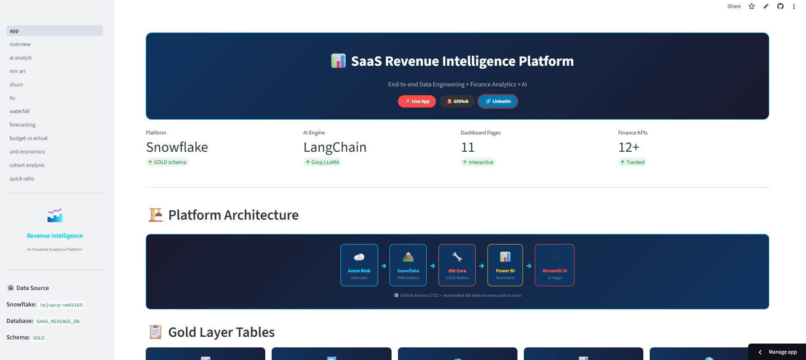
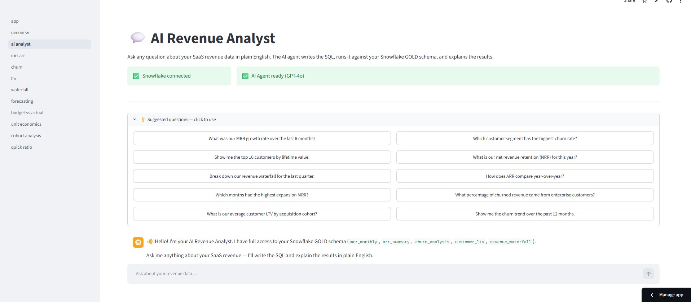
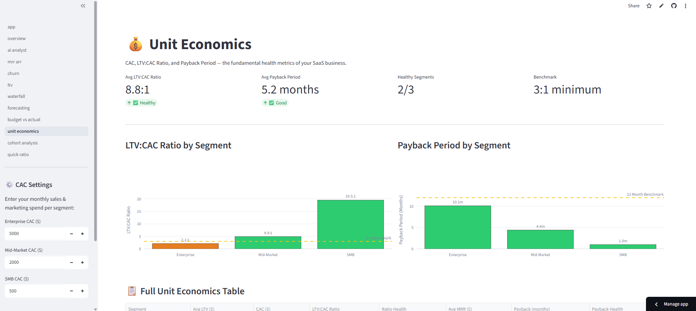
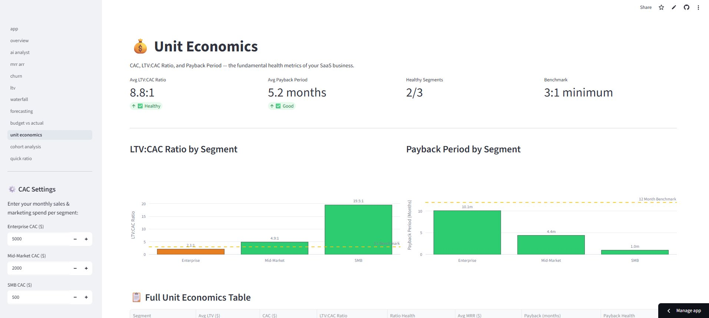

<div align="center">

# 📊 SaaS Revenue Intelligence Platform


### Production-Grade Data Engineering + Finance Analytics + AI

<br/>

[](https://krithesh-saas-platform.streamlit.app)
[](https://github.com/krithesh19/saas-revenue-platform)
[](https://linkedin.com/in/krithesh-analyst)
[](https://krithesh-analyst.netlify.app)

<br/>


<br/>

> *An end-to-end SaaS revenue intelligence platform — from raw cloud data to AI-powered finance analytics.*
> *Built to demonstrate production-grade data engineering, SaaS finance domain expertise, and modern AI integration.*

</div>

---

## 🌐 Live Application

<div align="center">

### 👉 [https://krithesh-saas-platform.streamlit.app](https://krithesh-saas-platform.streamlit.app)

*11 interactive pages • Live Snowflake data • AI Revenue Analyst • Finance dashboards • Excel exports*

</div>

---

## 📸 Platform Screenshots

### 🏠 Home Page — Platform Architecture & Navigation


<br/>

### 💬 AI Revenue Analyst — Natural Language Querying on Live Snowflake Data


<br/>

### 💰 Unit Economics — LTV:CAC Ratio & Payback Period by Segment


<br/>

### 📈 Revenue Forecasting — 6-Month ML Projection with 3 Scenarios


---

## 🏗️ Platform Architecture

```
╔══════════════════════════════════════════════════════════════════════════════╗
║               SAAS REVENUE INTELLIGENCE PLATFORM                            ║
╠══════════════════════════════════════════════════════════════════════════════╣
║                                                                              ║
║  ┌──────────┐   ┌──────────────┐   ┌──────────────┐   ┌──────────────────┐ ║
║  │  Azure   │   │  Snowflake   │   │  dbt Core    │   │    Power BI      │ ║
║  │   Blob   │──▶│  RAW Schema  │──▶│  STAGING     │──▶│    Dashboard     │ ║
║  │ Storage  │   │ (Ingestion)  │   │  + GOLD      │   │   DAX Measures   │ ║
║  └──────────┘   └──────────────┘   └──────┬───────┘   └──────────────────┘ ║
║  (Data Lake)   (Cloud Warehouse)           │          (Business Reports)    ║
║                                            ▼                                ║
║                          ┌──────────────────────────────┐                  ║
║                          │     Streamlit AI Platform     │                  ║
║                          │     11 Dashboard Pages        │                  ║
║                          │     LangChain SQL Agent       │                  ║
║                          │     Groq LLaMA 3.3 70B        │                  ║
║                          └──────────────────────────────┘                  ║
║                                                                              ║
║  ┌─────────────────────────────────────────────────────────────────────┐   ║
║  │  GitHub Actions CI/CD → dbt tests + models run on every push       │   ║
║  └─────────────────────────────────────────────────────────────────────┘   ║
║  ┌─────────────────────────────────────────────────────────────────────┐   ║
║  │  Docker → Single command deployment: docker-compose up              │   ║
║  └─────────────────────────────────────────────────────────────────────┘   ║
╚══════════════════════════════════════════════════════════════════════════════╝
```

---

## 🛠️ Technology Stack

| Layer | Technology | Why This Choice |
|:---|:---|:---|
| ☁️ **Cloud Storage** | Azure Blob Storage | Industry standard in Irish/European enterprise |
| 🏔️ **Data Warehouse** | Snowflake | Separates compute & storage; used by Stripe, HubSpot, Intercom |
| 🔄 **Transformation** | dbt Core | Engineering best practices — testing, versioning, lineage |
| 📊 **BI Dashboard** | Power BI + DAX | Most widely used BI tool in Irish/European companies |
| 🤖 **AI Framework** | LangChain | Industry standard for connecting LLMs to real data sources |
| 🧠 **LLM** | Groq + LLaMA 3.3 70B | Free, fastest inference, enterprise-grade open-source model |
| 🖥️ **Web App** | Streamlit | Pure Python web apps — perfect for data applications |
| 🐳 **Container** | Docker | Production-grade containerisation — runs anywhere |
| ⚙️ **CI/CD** | GitHub Actions | Automated dbt test runs on every push to main |
| 🐍 **Language** | Python + SQL | ETL pipelines, Streamlit app, dbt models |

---

## 📊 11 Interactive Dashboard Pages

### 📌 Core Revenue Analytics

| # | Page | What You'll Find |
|:---:|:---|:---|
| 1 | 🏠 **Platform Overview** | Live Snowflake connection, row counts per table, snapshot KPIs |
| 2 | 💬 **AI Revenue Analyst** | Ask questions in plain English — AI writes SQL, queries Snowflake, explains results |
| 3 | 📈 **MRR & ARR Analytics** | Revenue trends, MoM growth, segment breakdown, ARR summary |
| 4 | 🔄 **Churn Analysis** | Churn by month, category, and segment with dual-axis charts |
| 5 | 💎 **Customer LTV** | LTV distribution histogram, cohort line chart, top 20 customers table |
| 6 | 🌊 **Revenue Waterfall** | MRR movement — New vs Retained revenue over time |

### 📌 Finance Analytics (FP&A Level)

| # | Page | What You'll Find |
|:---:|:---|:---|
| 7 | 📈 **Revenue Forecasting** | 6-month ML projection — Best / Base / Worst case scenarios |
| 8 | 📊 **Budget vs Actuals** | Variance analysis with RAG traffic-light status per month |
| 9 | 💰 **Unit Economics** | CAC by segment, LTV:CAC ratio, Payback period analysis |
| 10 | 🔄 **Cohort Analysis** | LTV heatmap by acquisition cohort and customer segment |
| 11 | ⚡ **Quick Ratio & Rule of 40** | SaaS health metrics with gauge charts and trend bars |

> 📥 **Every page has an Export to Excel button** for finance team workflows

---

## 🤖 AI Revenue Analyst — How It Works

```
┌─────────────────────────────────────────────────────────────┐
│                                                             │
│  User: "Which segment has the highest churn rate?"          │
│                         │                                   │
│                         ▼                                   │
│          LangChain SQL Agent (Groq LLaMA 3.3 70B)           │
│                         │                                   │
│                         ▼  generates SQL                    │
│   SELECT SEGMENT, COUNT(*) AS churned,                      │
│   SUM(LOST_MRR) AS lost_revenue                             │
│   FROM SAAS_REVENUE_DB.GOLD.churn_analysis                  │
│   GROUP BY SEGMENT ORDER BY churned DESC                    │
│                         │                                   │
│                         ▼  executes on Snowflake            │
│   "Enterprise leads with 38% of churned customers,          │
│    contributing $42K in lost MRR.                           │
│    💡 Insight: Focus retention on Enterprise —              │
│    highest revenue at risk."                                │
│                                                             │
└─────────────────────────────────────────────────────────────┘
```

**Example questions you can ask:**
- *"What was our MRR growth rate over the last 6 months?"*
- *"Show me the top 10 customers by lifetime value."*
- *"What is our net revenue retention for this year?"*
- *"Which months had the highest expansion MRR?"*
- *"Break down our revenue waterfall for the last quarter."*

---

## 💰 SaaS Finance KPIs — Full Coverage

| Metric | Formula | Benchmark | Status |
|:---|:---|:---:|:---:|
| **MRR** | Sum of active subscription values | Growing MoM | ✅ |
| **ARR** | MRR × 12 | Growing YoY | ✅ |
| **Churn Rate** | Churned customers / Total customers | < 5% monthly | ✅ |
| **NRR** | (Start + Expansion − Contraction − Churn) / Start | > 100% | ✅ |
| **Customer LTV** | Avg MRR / Churn Rate | > 3× CAC | ✅ |
| **CAC** | Marketing Spend / New Customers | LTV ÷ 3 max | ✅ |
| **LTV:CAC Ratio** | LTV / CAC | > 3:1 | ✅ |
| **Payback Period** | CAC / Avg MRR per customer | < 12 months | ✅ |
| **Quick Ratio** | (New + Expansion) / (Churn + Contraction) | > 4 | ✅ |
| **Rule of 40** | Growth % + Profit Margin % | > 40 | ✅ |
| **Budget vs Actuals** | (Actual − Budget) / Budget × 100 | Within ±5% | ✅ |
| **Revenue Forecast** | ML linear regression + 3 scenarios | Directional | ✅ |

---

## 📋 Snowflake GOLD Schema

| Table | Rows | Key Columns | Used In |
|:---|:---:|:---|:---|
| `mrr_monthly` | 5,057 | INVOICE_MONTH, SEGMENT, MRR, ARR | MRR, Forecasting, Budget |
| `churn_analysis` | 500 | CHURN_MONTH, SEGMENT, LOST_MRR, CHURN_CATEGORY | Churn, Unit Economics |
| `customer_ltv` | 500 | CUSTOMER_ID, SEGMENT, PROJECTED_LTV, SIGNUP_DATE | LTV, Cohort, Unit Economics |
| `arr_summary` | 24 | INVOICE_MONTH, TOTAL_ARR, TOTAL_MRR | MRR & ARR page |
| `revenue_waterfall` | 47 | INVOICE_MONTH, MRR_MOVEMENT_TYPE, TOTAL_MRR | Waterfall, Quick Ratio |

---

## ⚙️ CI/CD Pipeline

```
Push code to main branch
          │
          ▼
  GitHub Actions triggered
          │
          ├── ✅ Setup Python 3.11
          ├── ✅ Install dbt-snowflake
          ├── ✅ Configure Snowflake from GitHub Secrets
          ├── ✅ Run dbt deps
          ├── ✅ Run 14 data quality tests
          └── ✅ Run all 5 GOLD models
                    │
          ┌─────────┴──────────┐
          ▼                    ▼
    PASS → Continue      FAIL → Block merge
```

---

## 🐳 Docker Deployment

```bash
# Clone and run with one command
git clone https://github.com/krithesh19/saas-revenue-platform.git
cd saas-revenue-platform

# Add your .env file with Snowflake + Groq credentials
# Then launch everything:
docker-compose up

# App available at → http://localhost:8501
```

---

## 🚀 Local Setup

**1. Clone the repository**
```bash
git clone https://github.com/krithesh19/saas-revenue-platform.git
cd saas-revenue-platform
```

**2. Install dependencies**
```bash
pip install -r streamlit_app/requirements.txt
```

**3. Configure `.env` file**
```env
SNOWFLAKE_ACCOUNT=your_account
SNOWFLAKE_USER=your_username
SNOWFLAKE_PASSWORD=your_password
SNOWFLAKE_WAREHOUSE=SAAS_WH
SNOWFLAKE_DATABASE=SAAS_REVENUE_DB
SNOWFLAKE_SCHEMA=GOLD
GROQ_API_KEY=your_groq_api_key
```

**4. Run dbt models**
```bash
cd saas_revenue_dbt
dbt deps && dbt run && dbt test
```

**5. Launch the app**
```bash
streamlit run streamlit_app/app.py
```

---

## 📁 Repository Structure

```
saas-revenue-platform/
│
├── 📂 etl/
│   └── pipeline.py                   # Azure Blob → Snowflake ETL
│
├── 📂 saas_revenue_dbt/              # dbt transformation project
│   ├── dbt_project.yml
│   └── 📂 models/
│       ├── 📂 staging/               # Cleaned source data
│       │   ├── stg_customers.sql
│       │   ├── stg_invoices.sql
│       │   └── stg_subscriptions.sql
│       └── 📂 gold/                  # Business-ready analytics
│           ├── mrr_monthly.sql
│           ├── arr_summary.sql
│           ├── churn_analysis.sql
│           ├── customer_ltv.sql
│           └── revenue_waterfall.sql
│
├── 📂 streamlit_app/                 # Web application
│   ├── app.py                        # Main entry point + home page
│   ├── requirements.txt              # Python dependencies
│   ├── 📂 pages/                     # 11 dashboard pages
│   │   ├── 1_overview.py
│   │   ├── 2_ai_analyst.py
│   │   ├── 3_mrr_arr.py
│   │   ├── 4_churn.py
│   │   ├── 5_ltv.py
│   │   ├── 6_waterfall.py
│   │   ├── 7_forecasting.py
│   │   ├── 8_budget_vs_actual.py
│   │   ├── 9_unit_economics.py
│   │   ├── 10_cohort_analysis.py
│   │   └── 11_quick_ratio.py
│   └── 📂 utils/
│       ├── snowflake_connector.py    # Snowflake connection manager
│       └── langchain_agent.py        # LangChain SQL agent
│
├── 📂 .github/workflows/
│   └── dbt_ci.yml                    # GitHub Actions CI/CD
│
├── 📂 screenshots/                   # App screenshots for README
├── 📂 powerbi/                       # Power BI dashboard (.pbix)
├── Dockerfile                        # Container definition
├── docker-compose.yml                # Multi-service orchestration
└── README.md
```

---

## ✅ Skills Demonstrated

| Skill Area | Technologies | Level |
|:---|:---|:---:|
| **Data Engineering** | Azure, Snowflake, Python ETL, dbt | ⭐⭐⭐⭐⭐ |
| **Data Modelling** | Medallion architecture RAW → STAGING → GOLD | ⭐⭐⭐⭐⭐ |
| **SQL** | Snowflake SQL, window functions, CTEs | ⭐⭐⭐⭐⭐ |
| **Python** | pandas, Streamlit, LangChain, connectors | ⭐⭐⭐⭐⭐ |
| **BI & Reporting** | Power BI, DAX measures, KPI dashboards | ⭐⭐⭐⭐⭐ |
| **AI / LLM** | LangChain agents, Groq, prompt engineering | ⭐⭐⭐⭐ |
| **Finance Domain** | MRR, ARR, NRR, LTV:CAC, Quick Ratio, Rule of 40 | ⭐⭐⭐⭐⭐ |
| **DevOps / CI/CD** | GitHub Actions, Docker containerisation | ⭐⭐⭐⭐ |
| **Cloud** | Azure Blob Storage, Snowflake cloud DW | ⭐⭐⭐⭐⭐ |
| **Deployment** | Streamlit Cloud, live public application | ⭐⭐⭐⭐⭐ |

---

## 👨‍💻 Author

<div align="center">

### Kritheshvar Vinothkumar

**MSc Data & Computational Science**
University College Dublin | Dublin, Ireland 🇮🇪

*Data Engineer & Analyst specialising in cloud data pipelines,*
*SaaS finance analytics, and AI-powered applications.*

<br/>

[](https://linkedin.com/in/krithesh-analyst)
[](https://github.com/krithesh19)
[](https://krithesh-analyst.netlify.app)
[](https://krithesh-saas-platform.streamlit.app)

</div>

---

<div align="center">

**⭐ If you found this project useful, please give it a star!**

*Built with ❤️ to demonstrate production-grade data engineering and SaaS finance analytics*

</div>
